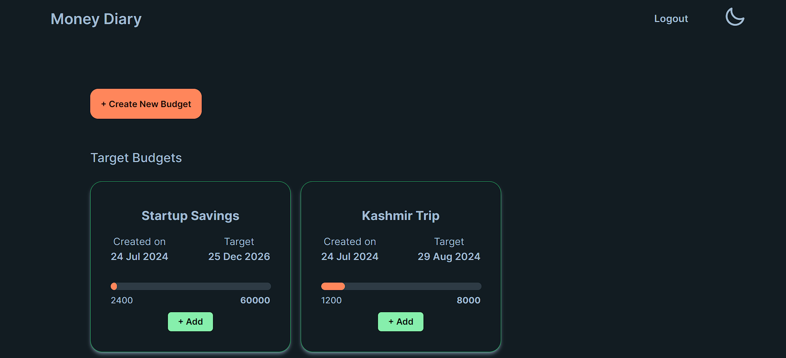
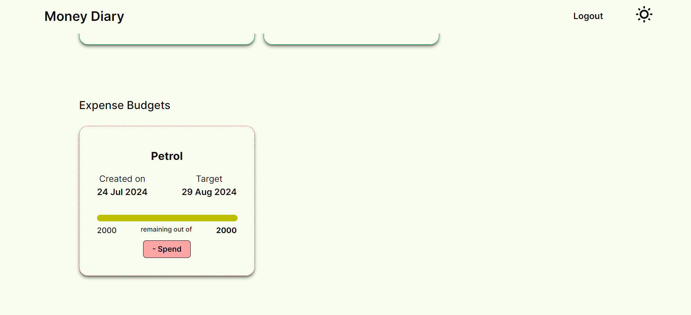
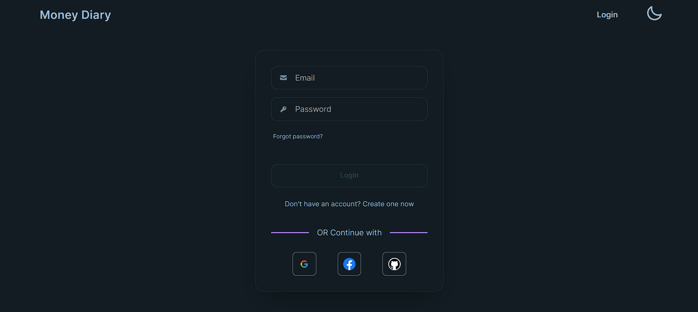
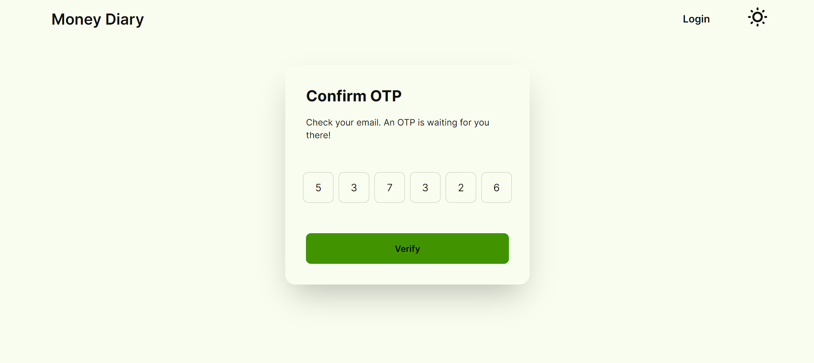

# Money Diary

A 'Money Diary' to manage contributions towards a financial goal, and manage expenses within pre-defined limits. Made using Next.js and Supabase.

## Table of Contents

- [Live Link](#live-link)
  - [Screenshots](#screenshots)
- [Features](#features)
- [Technologies Used](#technologies-used)
- [Running the Project Locally](#running-the-project-locally)

## Live Link

You can check out Money Diary [here](https://money-diary-app.vercel.app/).

### Screenshots









## Features

- Create, update and delete 'budgets'
- Two kinds of budgets - **Target Budgets** and **Expense Budgets**
- _Contribute_ to target budgets and _spend_ from expense budgets
- User authentication using **OTP verification** or social providers (Google, GitHub, and Facebook)
- Light/Dark Theme

## Technologies Used

- [Next.js](https://nextjs.org/)
- [Supabase](https://supabase.com/) for storage and authentication
- [Context API](https://react.dev/learn/passing-data-deeply-with-context)
- [TailwindCSS](https://tailwindcss.com/)
- [daisyUI](https://daisyui.com/)

## Running the Project Locally

These instructions will help you set up a copy of the project on your local machine.

### Prerequisites

Before getting started, make sure you have Node.js and npm (Node Package Manager) installed on your machine. This project requires Node.js version 18.17.0 or higher.

### Installing & Usage

1. Clone the repository to your local machine:

   ```bash
   git clone https://github.com/Krishnanand2517/money-diary
   ```

1. Navigate to the project directory & install the project dependencies:

   ```bash
   cd money-diary
   npm install
   ```

1. Copy the environment variables to a new file `.env.local`:

   ```bash
   cp .env.sample .env.local
   ```

   Obtain the values and API keys for the variables from your Supabase project (create a new Supabase project for money-diary, if you haven't done so already).

1. Once you have installed the project and its dependencies, you can run the development server:

   ```bash
   npm run dev
   ```

   This will start the development server on port 3000, and you can access the project in your web browser at http://localhost:3000/.

### Contribute

If you encounter any issues, have suggestions, or want to contribute, feel free to open an issue or submit a pull request. Happy coding!
